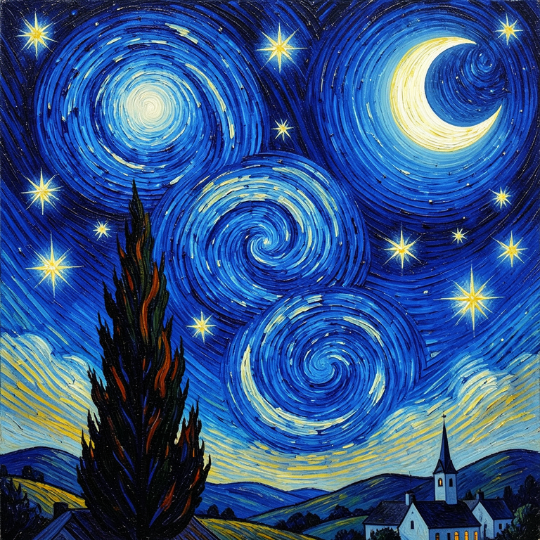
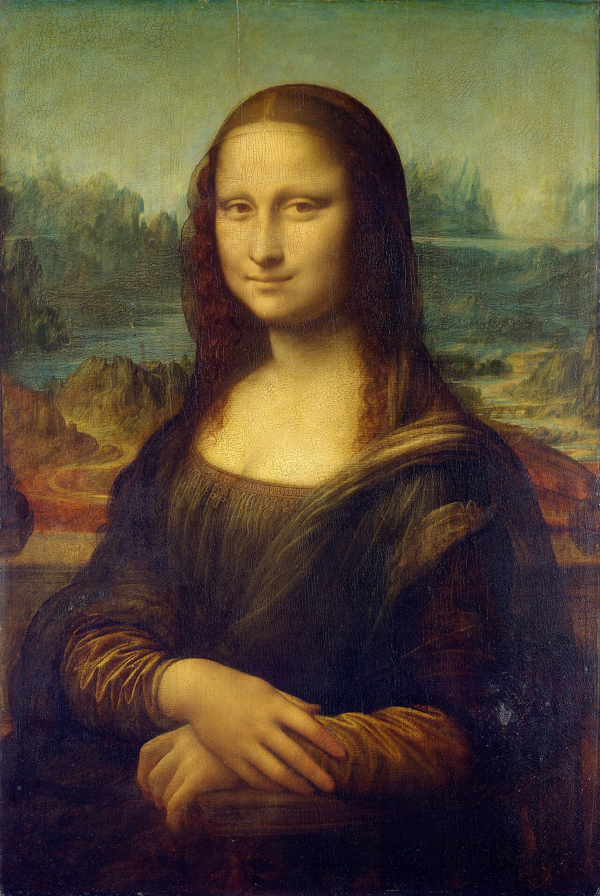
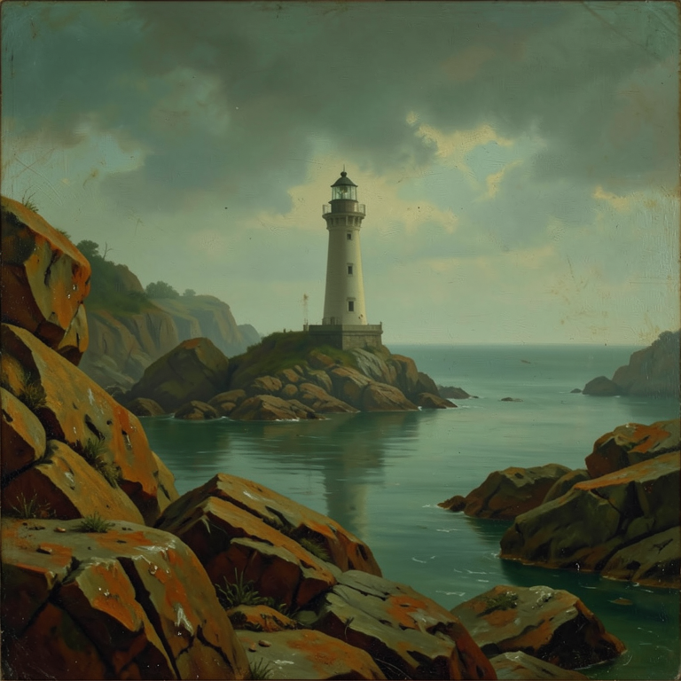
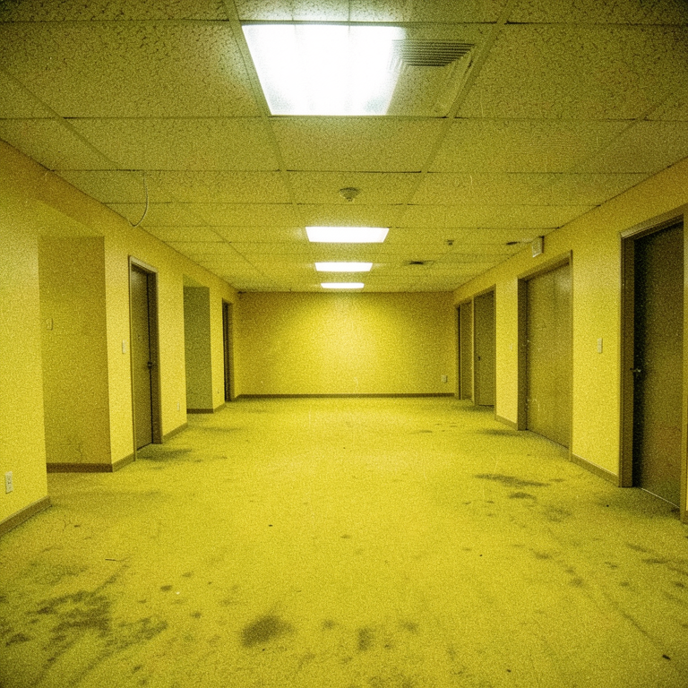
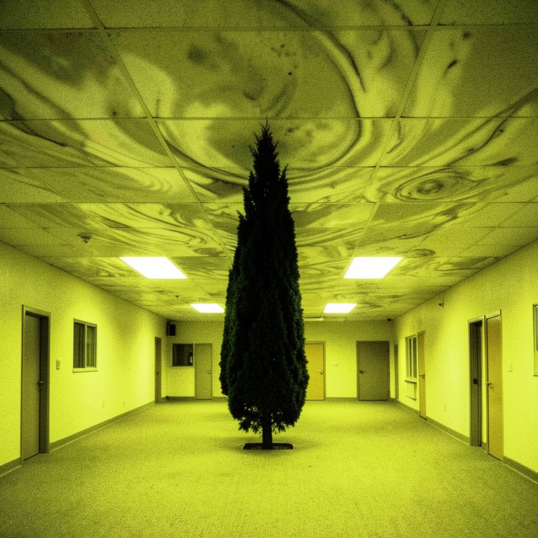

# Felt-1

**Felt-1 is an isoneural converter: it regenerates an artifact — optionally on
a subject you choose — so that, according to a brain-encoding model, the result
evokes the same neural response as a target.** The mood of a painting, carried
onto a different scene. A song's feeling, written as text. The invariant we
optimize is *predicted brain activation*, not pixels or words.

## The demo: same subject, different feelings

One instruction — "a lighthouse on a rocky coast" — re-rendered to match the
**vibe** of three different targets. The agent is shown the target's pixels with
an anonymized filename; it writes its own generation prompt and a search loop
climbs toward the target's neural signature.

| Vibe target | Felt-1 output (subject: a lighthouse) |
|---|---|
|  *The Starry Night* |  |
|  *Mona Lisa* |  |

The Mona Lisa output is the point: **no portrait, no da Vinci pastiche** — a
lighthouse in sfumato haze with old-master stillness. The feeling transferred;
the subject stayed.

## Vibe, not style: the conflict test

Style transfer would repaint the target's *content*. Vibe transfer should carry
its *feeling* onto unrelated content. So we forced the conflict: depict **The
Starry Night's scene** (cypress, swirling sky, village), but match the
**Backrooms'** liminal dread.

| Vibe target (the Backrooms) | Felt-1 output (subject: the Starry Night scene) |
|---|---|
|  |  |

The loop didn't paint office carpet. It re-staged the scene *inside the
feeling*: the cypress as an intruder in a fluorescent room, the swirling sky
become water-stains on ceiling tiles. **The output scores higher against the
Backrooms target (0.94) than against The Starry Night (0.92)** — it matches the
feeling source over the content source, despite depicting the starry content.
That cell — feeling > content on a content/vibe conflict — is the claim that
style transfer cannot make.

## Music → words: text that carries the feeling

Audio→text is the hardest pair (see below), but the clean-protocol runs now
separate distinct pieces. Given a 75-second **glitch-electronic** track the
agent never hears — it sees only an anonymized file and a title-free perceptual
caption — the loop produced this (music vocabulary is banned; the description
is evidence, not material):

> The beat is a body, the body a drum, the drum a deep thrum that thrums
> through the floor and up the bones, and the strings—oh the strings—they rise
> and rip, a long bright rip through the thick of it, a silver shiver, a shiver
> that shimmers, then shatters into a cascade of quick bright cuts from a voice
> that is not voice but struck wire, and the pulse beneath pulses on, presses
> on, pounds on, a steady shove in the chest […] a body wired bright and
> waiting for the next strike, the next shiver, the next shatter.

For the same run's **calm solo-piano** target, the winner is one long unhurried
breath instead — "…you are not waiting for anything, not wishing for anything,
simply present in the way water is present in a bowl that has been still so
long the stillness has grown soft and deep and warm around you."

The cross-score matrix confirms it isn't generic moodiness: the glitch text
wins its own column (+0.048) *and* prefers its own audio over the other
targets, while the calm text scores just **0.48** against the glitch piece.

## How it works

The shared space is Meta's **TRIBE v2**, a model trained to predict human fMRI
responses to video, audio, and language. Anything you run through it returns a
predicted activation trajectory over 20,484 cortical vertices, so artifacts in
*different* media become comparable in *one* space.

TRIBE stays frozen. Felt-1 **searches** over outputs:

```
target  ──render──►  TRIBE  ──►  target activation

   ┌──────────────── one round (repeats) ────────────────┐
   │  ranked past attempts + judge critique               │
   │        ──►  N agent candidates                        │
   │        ──render──►  TRIBE  ──►  score vs. target       │
   │        ──►  re-rank, judge critiques the new best      │
   └──────────────────────────────────────────────────────┘

           ──►  best output whose vibe matches the target
```

The search is **Ranked-Reflect** — an [OPRO](https://arxiv.org/abs/2309.03409)
"LLM as optimizer" loop with [Reflexion](https://arxiv.org/abs/2303.11366)
feedback. Each round, candidate agents see the ranked history of past attempts
plus a critique of the current best, and try to beat it — no hand-coded mutation
operators. Image outputs are *generated*: agents emit `flux:<prompt>` and the
orchestrator materializes them through a hosted Flux model, so the search climbs
in prompt space. Seeded runs ("depict X with this vibe") have the judge score
each candidate's fidelity to the seed, so chasing the vibe can't quietly abandon
the subject. Agent backends are pluggable with automatic failover
(`VOLTA_AGENT_BACKEND="codex,claude,deepseek"`).

## The hard part was the metric

Raw cosine over TRIBE activations is dominated by a **modality common mode** —
"this is music being heard" / "this is English being read." Under it, three
emotionally opposite pieces (Clair de Lune, Moonlight Sonata, Dvořák's New World
finale) score **0.88–0.92 against each other**, and a hand-written *calm* text
beats a *storm* text **on the storm piece**. Any search under that reward
converges to generically-evocative mush — ours did.

The fix is **anchor subtraction**: encode a diverse corpus per modality, subtract
the corpus mean from every activation frame before scoring. After anchoring,
wrong-emotion pairs go *negative* (the calm text scores −0.42 against Moonlight),
and a search run under the corrected metric found a **0.97** image match where
the broken metric topped out at 0.79. This is the load-bearing result.

We verify specificity with **cross-score matrices**: every winning output is
re-encoded and scored against *every* target; each target's own output should
win its column.

## What we found, including what didn't work

- **Seeded image→image vibe transfer**: 4/5 diagonal on a five-target gallery;
  the content/vibe-conflict test above passes. This is the strongest demo.
- **The anchored metric** is the real win — proven with hand-written ceiling
  texts and the 0.79→0.97 search improvement.
- **Cross-modal →text is harder and bounded by TRIBE's rendering paths.** Text
  is rendered via *speech synthesis*, so every text activation is acoustically
  speech; quiet piano then resembles speech more than a loud orchestra does, and
  audio→text under the plain anchored metric was a null (diagonal 0/3 with
  noise-level margins). Three additions fixed it: pre-screen targets for
  TRIBE-space separability (all energetic music is one 0.8–0.9-collinear blob —
  an unseparable target set is unwinnable before the search starts), a
  **battery-contrastive score** (`VOLTA_CONTRAST_WEIGHT`: a candidate's target
  similarity is z-normalized against its similarity to the whole anchor battery,
  so "evocative in general" gains nothing), and forced formal diversity across
  parallel candidates. Result: diagonal 3/3 then 2/3 across two runs — clearly
  distinct pieces separate with real margins; perceptually adjacent pairs remain
  coin flips. Specificity is real but resolution-limited. The same lesson holds
  for image→text: specificity tracks how perceptually *distinct* the targets
  are.
- **A rejected idea, kept honest:** we hypothesized that scoring only the
  affective/association brain networks (suppressing visual cortex) would isolate
  "feeling" from "looks-like." A 127-subset Yeo-7 ablation refuted it — for
  images, *visual cortex is the discriminating axis*; the affective networks are
  the collinear, noisy ones. The `VOLTA_VIBE_WEIGHT` knob ships at its default of
  0, documented as a dead end.

## Layout

Bun monorepo:

- `packages/core` — contracts and the scoring algorithm
  (`src/scoring/activation.ts`: anchored blend of pooled/temporal/dynamics/
  best-match cosines, plus the network-weighting knob).
- `packages/agent-sdk` — candidate/judge prompts and three agent backends
  (Codex CLI, Claude Code CLI, DeepSeek HTTP) with a failover chain.
- `services/orchestrator` — search loop, TRIBE oracle (mock / local Python /
  hosted HTTP), Flux generation, audio describer, anchors, the experiment
  harness, and readable per-run JSON artifacts.
- `apps/web` — Next.js trace explorer.
- `vendor/tribev2` — vendored Meta TRIBE v2 (frozen oracle).

## Quick start

```bash
bun install
bun run check          # biome lint + typecheck
bun run smoke          # text → text, mock oracle (offline, proves wiring)

# Real run (hosted TRIBE; an agent CLI — codex or claude — is required):
VOLTA_ORACLE=http VOLTA_SMOKE_IMAGE=path/to/photo.jpg bun run smoke:image

# Reproduce a cross-score experiment:
VOLTA_AGENT_BACKEND=claude bun run exp:matrix my-exp path/to/targets.json
```

Each run writes inspectable artifacts (target, per-iteration trajectory, scores,
judge critique, score curve) under the printed run root. Config knobs are in
[CLAUDE.md](CLAUDE.md).

TRIBE weights stay frozen. Felt-1 owns the agentic search layer around it.
