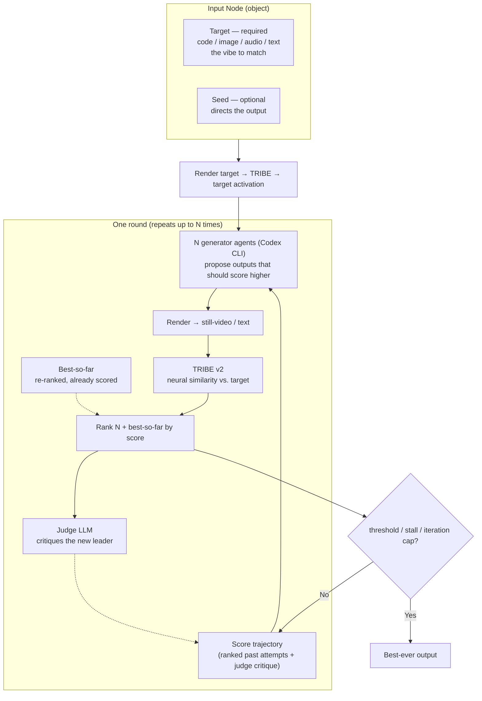

# Project Volta Architecture

Project Volta is an agentic neural-activation translation workbench — a
**vibe-transfer** system. It takes the "vibe" of one artifact and carries it
into a different medium: the feeling of a song becomes text, the mood of an
image becomes a UI, a paragraph's tone becomes a visual. Any format in, any
format out, with the vibe preserved.

The trick is a shared "vibe space." We use Meta's **TRIBE v2** — a model that
predicts how the brain responds to sights, sounds, and language — to map text,
audio, image, and video into one predicted-activation representation. Two
artifacts in *different* media become comparable in *one* space, so we can match
how something *feels* across a change of format.

TRIBE stays frozen and acts as the neural oracle. We never train it or touch
weights — Volta owns the agentic layer around media payloads, renderers,
scoring, and iteration. The invariant we preserve is predicted neural
activation, not literal text or pixels.

See [IO Modules](./IO_MODULES.md) for the concrete payload and node schema.

## Core Loop

```text
InputObj.inputNode.payload -> render -> target activation

trajectory (ranked past attempts + judge critique) -> agent outputs
AgentOutput.outputNode.payload -> render -> candidate activation

candidate activations -> score/rank -> judge critique -> next round's trajectory
```

The invariant is predicted neural activation, not literal text or pixels. The
optional seed constrains what the output should be about.

## Boundaries

- TypeScript owns schemas, render contracts, scoring, job state, and agent
  orchestration.
- Python owns the TRIBE bridge because TRIBE is a Python/PyTorch package.
- Nodes are thin `{ type, payload }` envelopes.
- Render functions consume payloads directly.
- Text and audio render directly to TRIBE artifacts.
- Image and code render through short visual artifacts for TRIBE.

## The Iteration

The search is **Ranked-Reflect** — an [OPRO](https://arxiv.org/abs/2309.03409)
"LLM as optimizer" loop with [Reflexion](https://arxiv.org/abs/2303.11366)-style
verbal feedback. It repeats until a similarity threshold (default ~90%), a stall
(no improvement for a few rounds), or an iteration cap.

The whole steering mechanism is **the ranked, critiqued history of attempts** —
there are no hand-coded mutation operators. Each round:

1. The candidate agents see the **score trajectory**: the best attempts so far,
   sorted worst-to-best by neural similarity (OPRO's ordering — the LLM weights
   the last, highest-scoring examples most), plus the judge's one-line
   **critique** of the current best (the Reflexion "verbal gradient").
2. They each propose one new candidate aimed at beating the current best.
   `VOLTA_CANDIDATE_COUNT` candidates are generated in parallel, and siblings
   are told to take deliberately different angles so the round explores rather
   than converges.
3. Each candidate is rendered and scored against the target. The reigning
   best-so-far is re-ranked alongside the fresh candidates (its activation is
   cached, so it costs zero TRIBE calls), guaranteeing `best(N+1) >= best(N)`.
4. The judge picks and critiques the new leader; that critique steers the next
   round.

The first round has no scored attempts yet, so the parallel candidates span
distinct emotional registers (awe, tenderness, stillness, tension, …) — TRIBE
scores the predicted *felt* response, so the opening job is to cover affective
space and let the scores reveal which register the target rewards.



A soft **anti-reward-hack guard** keeps the search honest: because the metric is
known to be gameable by repetition and generic fluent language, each candidate's
text novelty against everything already tried is folded into its score, so
resubmitting (or trivially rephrasing) the leader loses its diversity share
instead of riding the leader's neural similarity.

## Scoring the Vibe

Fitness is **neural similarity** between the candidate's activation trajectory
and the target's, in `[0, 1]` (`packages/core/src/scoring/activation.ts`). A
naive full-vector cosine is *gameable* — repetition and generic language inflate
it — so the metric blends three views of the `[timesteps, vertices]` trajectory:

- **Pooled (0.4)** — cosine of the mean-centered time-*average*. Length-invariant,
  so a ~2-frame image and the ~23-frame text rendered from it stay comparable;
  this is the term that makes a true text↔text vibe-match outrank a
  same-topic/opposite-vibe counterfactual.
- **Resampled trajectory (0.3)** — per-frame *pattern* (temporal cosine) plus
  frame-to-frame *motion* (dynamics cosine), after resampling both traces to
  their common length so every frame contributes. Captures the
  turbulence/stillness signature a time-average discards.
- **Best-match (0.3)** — for each target frame, its cosine to the *best-matching*
  candidate frame (averaged both directions), widening the cross-modal gradient.

Validated on real TRIBE activations (exp-2 probe set, a Starry-Night image→text
transfer, and an 8-persona style sweep): the true vibe-match ranks #1, the
repetition reward-hack scores ~0.08 below it, and flat semantic description
ranks last — **TRIBE rewards predicted emotional response, not literal
description.** `ScoreBundle.total` blends `neuralSimilarity` (0.7) with
`seedAdherence` / `coherence` / `diversity` placeholders; neural similarity is
the only term currently computed from activations.

## Current Scaffold

The repo now has a configurable multi-iteration MVP for the agent loop. It can
run the Codex CLI backend by default, or the deterministic backend for fast
smokes. Each agent receives an isolated workspace folder, and each run writes
readable artifacts under `.volta/runs/<runId>/`. SQLite is only the run index;
full run data lives in JSON files such as `run.json`, `input.json`,
`output-request.json`, root `target.json`, `evolution-journal.json`, and
per-iteration `scores.json` / `judge.json` / `iteration.json`.

Runs are resumable after completion. `POST /runs/:id/resume` loads the saved
target activation and latest `NextIterationSeed`, then appends new
`iterations/NNN` folders. On resume, `loop.maxIterations` means additional
iterations to append, not total run length.

The Codex backend (`packages/agent-sdk`) is the only agent backend: it shells
out to `codex exec` with prompt-template functions for exploration candidates,
improvement candidates, and judges, then asks Codex for strict JSON output
nodes/decisions via `--output-schema`. When image or code-screenshot nodes point
at local image files, the backend also passes those files to `codex exec
--image` so visual targets can be inspected directly. The score trajectory shown
to each candidate is assembled in `services/orchestrator/src/trajectory.ts`,
which also computes the text-novelty anti-hack guard.

The render boundary (`services/orchestrator/src/render.ts`) is implemented for
all four media: text becomes a word-timed text stimulus, audio passes through as
an audio artifact, and image/code render to a still-hold video for TRIBE. Audio
targets are also **described** for the agents (`describer.ts`, soft-fail): a
hosted Qwen2.5-Omni service writes a perceptual caption and a local DSP pass
(`python/audio_features.py`) adds objective musical structure — tempo, energy,
brightness, key — that the caption misses. **Flux image generation is configured
but not yet wired into the agent backend** — image-output agents currently emit
a conceptual asset URI rather than a generated image — and the MCP tool gateway
and code-screenshot capture remain open. Weave traces the Evolution Journal. See
[IO Modules](./IO_MODULES.md#scaffold-status) for the broader checklist.
