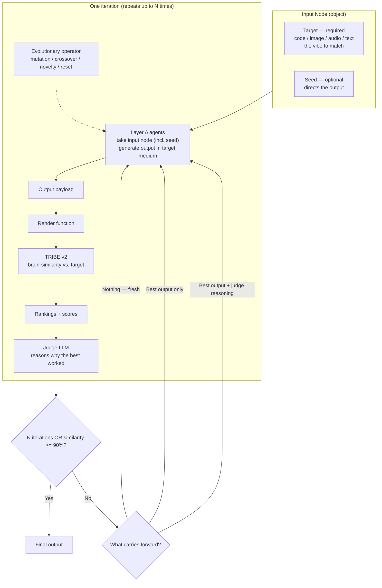

# Project Volta Architecture

Project Volta is an agentic neural-activation translation workbench — a
**vibe-transfer** system. It takes the "vibe" of one artifact and carries it
into a different medium: the feeling of a song becomes text, the mood of an
image becomes a UI, a paragraph's tone becomes a visual. Any format in, any
format out, with the vibe preserved.

The trick is a shared "vibe space." We use Meta's **TRIBE v2** — a model that
predicts how the brain responds to sights, sounds, and language — to map text,
audio, image, and video into one predicted-activation representation. Two
artifacts in *different* media become comparable in *one* space, so we can match
how something *feels* across a change of format.

TRIBE stays frozen and acts as the neural oracle. We never train it or touch
weights — Volta owns the agentic layer around media payloads, renderers,
scoring, and iteration. The invariant we preserve is predicted neural
activation, not literal text or pixels.

See [IO Modules](./IO_MODULES.md) for the concrete payload and node schema.

## Core Loop

```text
InputObj.inputNode.payload -> render -> target activation

InputObj + OutputObj + entropy -> agent outputs
AgentOutput.outputNode.payload -> render -> candidate activation

candidate activations -> score/rank -> judge reasoning -> next iteration seed
```

The invariant is predicted neural activation, not literal text or pixels. The
optional seed constrains what the output should be about.

## Boundaries

- TypeScript owns schemas, render contracts, scoring, job state, and agent
  orchestration.
- Python owns the TRIBE bridge because TRIBE is a Python/PyTorch package.
- Nodes are thin `{ type, payload }` envelopes.
- Render functions consume payloads directly.
- Text and audio render directly to TRIBE artifacts.
- Image and code render through short visual artifacts for TRIBE.

## The Iteration

The loop behaves like a genetic algorithm over output states, repeating until a
fixed number of iterations or a similarity threshold (~90%). Layer A agents see
only the input node and seed; later layers may also receive the previous best
output, archive population, and the judge's reasoning. Each agent carries an
assigned evolutionary operator — for example elite preservation, point mutation,
crossover, ablation, novelty injection, diagnostic-axis correction, or
representation reset — so candidates explore different behavior regions without
hard-coding a particular target artifact.



The judge sees only rankings/scores plus the seed and input; its reasoning is
carried forward via `NextIterationSeed` to preserve context the next generation
would otherwise lose.

## Current Scaffold

The repo now has a configurable multi-iteration MVP for the agent loop. It can
run the Codex CLI backend by default, or the deterministic backend for fast
smokes. Each agent receives an isolated workspace folder, and each run writes
readable artifacts under `.volta/runs/<runId>/`. SQLite is only the run index;
full run data lives in JSON files such as `run.json`, `input.json`,
`output-request.json`, root `target.json`, `evolution-journal.json`, and
per-iteration `scores.json` / `judge.json` / `iteration.json`.

Runs are resumable after completion. `POST /runs/:id/resume` loads the saved
target activation and latest `NextIterationSeed`, then appends new
`iterations/NNN` folders. On resume, `loop.maxIterations` means additional
iterations to append, not total run length.

The Codex backend uses prompt-template functions for first-generation
candidates, refinement candidates, and judges, then asks Codex for strict JSON
output nodes/decisions. When image or code-screenshot nodes point at local image
files, the backend also passes those files to `codex exec --image` so visual
targets can be inspected directly. Weave can trace the Evolution Journal. The
MCP tool gateway, Flux image generation, audio vibe description/cache, and
production renderers are still open implementation work. See
[IO Modules](./IO_MODULES.md#scaffold-status) for the broader checklist.
