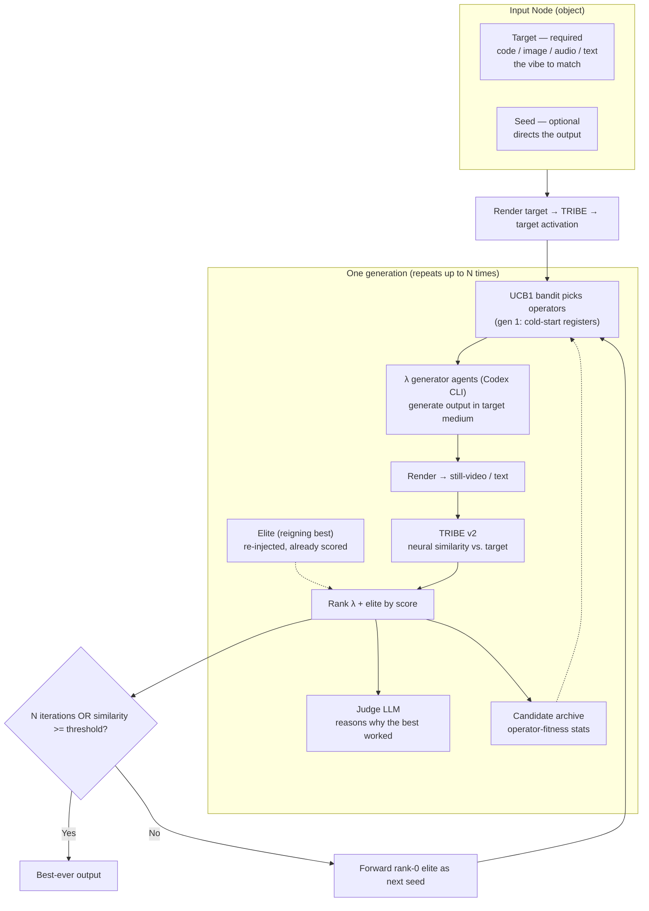

# Project Volta Architecture

Project Volta is an agentic neural-activation translation workbench — a
**vibe-transfer** system. It takes the "vibe" of one artifact and carries it
into a different medium: the feeling of a song becomes text, the mood of an
image becomes a UI, a paragraph's tone becomes a visual. Any format in, any
format out, with the vibe preserved.

The trick is a shared "vibe space." We use Meta's **TRIBE v2** — a model that
predicts how the brain responds to sights, sounds, and language — to map text,
audio, image, and video into one predicted-activation representation. Two
artifacts in *different* media become comparable in *one* space, so we can match
how something *feels* across a change of format.

TRIBE stays frozen and acts as the neural oracle. We never train it or touch
weights — Volta owns the agentic layer around media payloads, renderers,
scoring, and iteration. The invariant we preserve is predicted neural
activation, not literal text or pixels.

See [IO Modules](./IO_MODULES.md) for the concrete payload and node schema.

## Core Loop

```text
InputObj.inputNode.payload -> render -> target activation

InputObj + OutputObj + entropy -> agent outputs
AgentOutput.outputNode.payload -> render -> candidate activation

candidate activations -> score/rank -> judge reasoning -> next iteration seed
```

The invariant is predicted neural activation, not literal text or pixels. The
optional seed constrains what the output should be about.

## Boundaries

- TypeScript owns schemas, render contracts, scoring, job state, and agent
  orchestration.
- Python owns the TRIBE bridge because TRIBE is a Python/PyTorch package.
- Nodes are thin `{ type, payload }` envelopes.
- Render functions consume payloads directly.
- Text and audio render directly to TRIBE artifacts.
- Image and code render through short visual artifacts for TRIBE.

## The Iteration

The loop is a **(1 + λ) evolutionary strategy** over output states, repeating
until a fixed number of iterations or a similarity threshold (default ~90%).
`λ` (`VOLTA_CANDIDATE_COUNT`) challenger candidates are generated each
generation; the reigning global best — the **elite** — is carried forward
unchanged and re-injected as an already-scored candidate, so by construction
`best(N+1) >= best(N)` (and re-injecting it costs zero TRIBE calls). The elite,
not the judge's pick, is what seeds the next generation: every challenger is a
mutation *of the champion*.

Each candidate carries an **operator** drawn from two libraries
(`run.ts`):

- **Generation 1 — cold-start registers.** Nine distinct *emotional registers*
  (sublime-dread, intimate-tender, visceral-bodily, ecstatic-rapturous,
  naive-wonder, desolate-still, lyric-incantatory, contrastive-tension,
  anti-literal-perceptual). These are affective stances toward the *same*
  target, not feature checklists — TRIBE scores the predicted emotional
  response, so the first generation's job is to span affective space and let the
  optimizer keep whichever the target rewards.
- **Generations 2+ — refinement operators.** Twelve mutation operators (elitist
  point mutation, elite crossover, ablation, novelty injection,
  diagnostic-axis correction, operator-fitness exploit, …) applied to the elite.

Operator selection is a **UCB1 bandit** (`planOperators`) over the candidate
archive's measured per-operator fitness: each operator's score is its mean
neural similarity so far (exploitation) plus an optimistic exploration bonus, so
proven winners are favored while under-tried operators are always eventually
sampled. A **stall detector** (`isEliteStalled`) widens the exploration weight
when the best score stops improving. The plan is deterministic given the archive
(no `Math.random`), so smokes stay reproducible.



The judge sees the ranked candidates plus the seed and input and records *why*
the best one worked; that reasoning is preserved in `NextIterationSeed`. The
loop always forwards the post-injection rank-0 output (the elite) as the seed,
so the next generation's challengers mutate the champion rather than
re-deriving from scratch — the climbing half of the (1 + λ) strategy.

## Scoring the Vibe

Fitness is **neural similarity** between the candidate's activation trajectory
and the target's, in `[0, 1]` (`packages/core/src/scoring/activation.ts`). A
naive full-vector cosine is *gameable* — repetition and generic language inflate
it — so the metric blends three views of the `[timesteps, vertices]` trajectory:

- **Pooled (0.4)** — cosine of the mean-centered time-*average*. Length-invariant,
  so a ~2-frame image and the ~23-frame text rendered from it stay comparable;
  this is the term that makes a true text↔text vibe-match outrank a
  same-topic/opposite-vibe counterfactual.
- **Resampled trajectory (0.3)** — per-frame *pattern* (temporal cosine) plus
  frame-to-frame *motion* (dynamics cosine), after resampling both traces to
  their common length so every frame contributes. Captures the
  turbulence/stillness signature a time-average discards.
- **Best-match (0.3)** — for each target frame, its cosine to the *best-matching*
  candidate frame (averaged both directions), widening the cross-modal gradient.

Validated on real TRIBE activations (exp-2 probe set, a Starry-Night image→text
transfer, and an 8-persona style sweep): the true vibe-match ranks #1, the
repetition reward-hack scores ~0.08 below it, and flat semantic description
ranks last — **TRIBE rewards predicted emotional response, not literal
description.** `ScoreBundle.total` blends `neuralSimilarity` (0.7) with
`seedAdherence` / `coherence` / `diversity` placeholders; neural similarity is
the only term currently computed from activations.

## Current Scaffold

The repo now has a configurable multi-iteration MVP for the agent loop. It can
run the Codex CLI backend by default, or the deterministic backend for fast
smokes. Each agent receives an isolated workspace folder, and each run writes
readable artifacts under `.volta/runs/<runId>/`. SQLite is only the run index;
full run data lives in JSON files such as `run.json`, `input.json`,
`output-request.json`, root `target.json`, `evolution-journal.json`, and
per-iteration `scores.json` / `judge.json` / `iteration.json`.

Runs are resumable after completion. `POST /runs/:id/resume` loads the saved
target activation and latest `NextIterationSeed`, then appends new
`iterations/NNN` folders. On resume, `loop.maxIterations` means additional
iterations to append, not total run length.

The Codex backend (`packages/agent-sdk`) is the only agent backend: it shells
out to `codex exec` with prompt-template functions for first-generation
candidates, refinement candidates, and judges, then asks Codex for strict JSON
output nodes/decisions via `--output-schema`. When image or code-screenshot
nodes point at local image files, the backend also passes those files to
`codex exec --image` so visual targets can be inspected directly. The candidate
archive (`archive.ts`) accumulates per-operator fitness stats that feed the
UCB1 bandit and supply prompt context (top/diverse/recent prior candidates).

The render boundary (`services/orchestrator/src/render.ts`) is implemented for
all four media: text becomes a word-timed text stimulus, audio passes through as
an audio artifact, and image/code render to a still-hold video for TRIBE. Audio
targets are also described by the hosted audio service (`describer.ts`,
soft-fail) so agents get perceptual context they can't hear. **Flux image
generation is configured but not yet wired into the agent backend** — image-
output agents currently emit a conceptual asset URI rather than a generated
image — and the MCP tool gateway and code-screenshot capture remain open. Weave
traces the Evolution Journal. See
[IO Modules](./IO_MODULES.md#scaffold-status) for the broader checklist.
